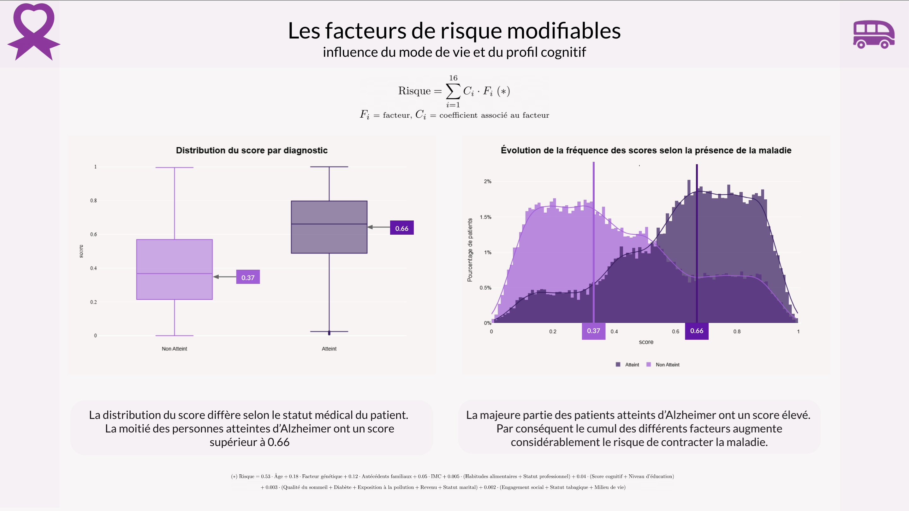

# 🧠 Projet Data : Prévention de la maladie d’Alzheimer

## 🎯 Problématique
Quels sont les **facteurs de risque** et les **profils types de patients** à cibler, afin de **renforcer la prévention de la maladie d’Alzheimer** et réduire son **impact sanitaire et économique en France** ?  

---

## 👥 Cas d’usage (User stories)

Nous sommes une équipe de **Data Analysts du Wagon** et nous présentons ce projet au **Ministère de la Santé** :  

- En tant que **Ministre de la Santé**, je veux identifier les **facteurs modifiables** les plus liés à Alzheimer (activité physique, pollution, éducation), afin de lancer des campagnes nationales de prévention.  
- En tant que **Ministre de la Santé**, je veux visualiser des **profils de patients à haut risque**, afin d’illustrer concrètement au grand public l’impact de la prévention sur le coût annuel par individu *(≈37 000 €/an)*.  
- En tant que **Ministre de la Santé**, je veux montrer la **progression de la maladie dans le temps**, afin de sensibiliser à l’importance d’un dépistage précoce qui évite des soins lourds et coûteux.  

---

## 📊 Données utilisées  

- Données synthétiques : [Alzheimer’s Prediction Dataset – Kaggle](https://www.kaggle.com/datasets/ankushpanday1/alzheimers-prediction-dataset-global)  
- Données publiques de l’Assurance Maladie (Ameli) :  
- [Dépenses de santé](https://data.ameli.fr/explore/dataset/depenses/information/)  
- [Effectifs de patients](https://data.ameli.fr/explore/dataset/effectifs/information/)  

---

## 🔧 Méthodologie

1. **Collecte & préparation des données**  
   - Croisement de données médicales synthétiques (patients, facteurs de risque) et de données publiques économiques (dépenses, effectifs).  
   - Nettoyage, normalisation et agrégation pour rendre les sources compatibles.  

2. **Analyse exploratoire & Machine Learning**  
   - Mise en évidence des **facteurs modifiables** liés au risque (ex : activité physique, pollution, éducation).  
   - Utilisation du **Machine Learning** pour calculer un **score de risque individuel** (compris entre 0 et 1).  
   - Chaque facteur de risque (diabète, tabagisme, etc.) est pondéré par son **coefficient d’importance** dans l’apparition de la maladie (estimé par le modèle).  
   - Le score global correspond à la **somme pondérée des facteurs de risque**.  
   - Ce score a permis d’identifier des **profils patients à haut risque** et d’illustrer l’impact potentiel de la prévention.  

3. **Visualisation & communication**  
   - Création d’un **dashboard Looker Studio** pour présenter les résultats de manière interactive et accessible aux décideurs.  

---

## 📈 Résultats

- Identification de facteurs de risque **modifiables** sur lesquels agir pour réduire l’incidence.  
- Définition de **profils patients à haut risque** avec mise en avant des coûts associés.  
- Simulation de l’impact d’une **prévention ciblée** sur les coûts annuels liés à Alzheimer.  

---

## 📊 Dashboard interactif  

👉 [Voir le dashboard Looker Studio](https://lookerstudio.google.com/reporting/448bf429-c8c9-4b0a-b77a-8d4faa133883/page/p_05eftxbrvd)  

Exemple de visualisation (capture d’écran) :  
  

---

## 🛠️ Outils & stack technique  

- **Python (pandas, scikit-learn)**  
- **SQL (BigQuery)**  
- **Google Cloud Platform (GCP)**  
- **Looker Studio**  

---

## 👩‍💻 Auteurs
Projet réalisé par des **Data Analysts du Wagon**, présenté au **Ministère de la Santé**.  
